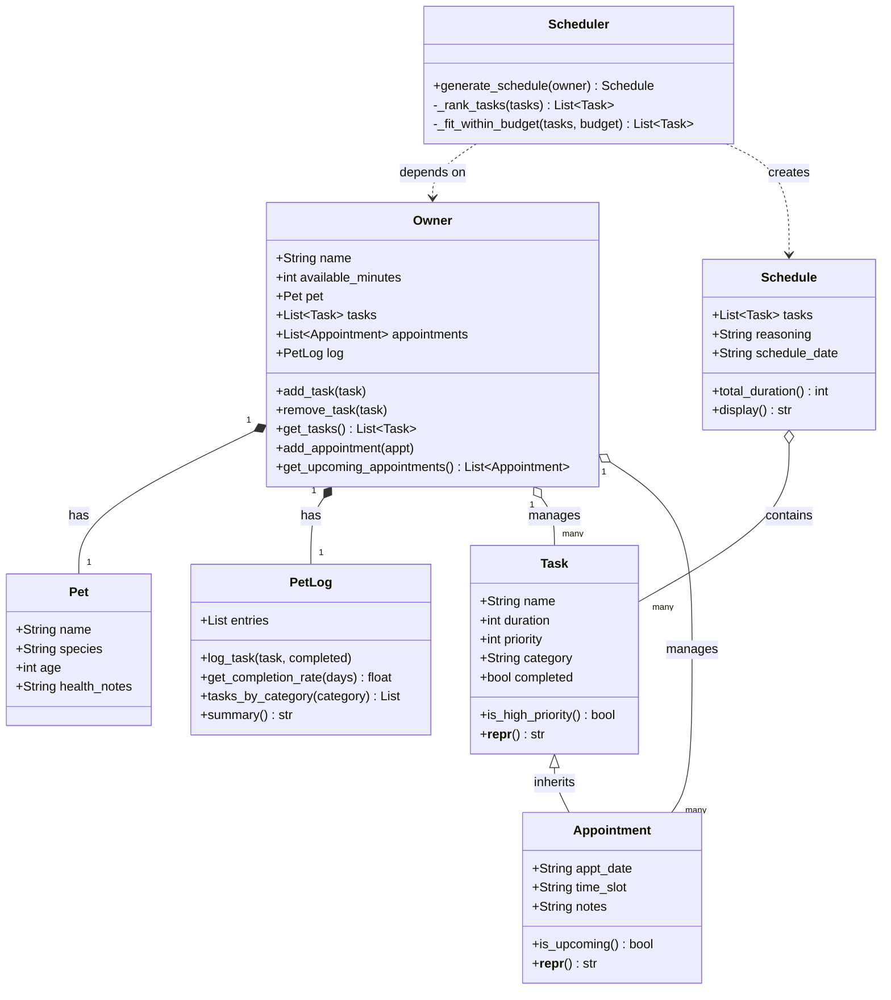

# PawPal+ UML Class Diagram

```mermaid
classDiagram
    class Pet {
        +String name
        +String species
        +int age
        +String health_notes
    }

    class Task {
        +String name
        +int duration
        +int priority
        +String category
        +bool completed
        +is_high_priority() bool
        +__repr__() str
    }

    class Appointment {
        +String appt_date
        +String time_slot
        +String notes
        +is_upcoming() bool
        +__repr__() str
    }

    class PetLog {
        +List entries
        +log_task(task, completed)
        +get_completion_rate(days) float
        +tasks_by_category(category) List
        +summary() str
    }

    class Owner {
        +String name
        +int available_minutes
        +Pet pet
        +List~Task~ tasks
        +List~Appointment~ appointments
        +PetLog log
        +add_task(task)
        +remove_task(task)
        +get_tasks() List~Task~
        +add_appointment(appt)
        +get_upcoming_appointments() List~Appointment~
    }

    class Schedule {
        +List~Task~ tasks
        +String reasoning
        +String schedule_date
        +total_duration() int
        +display() str
    }

    class Scheduler {
        +generate_schedule(owner) Schedule
        -_rank_tasks(tasks) List~Task~
        -_fit_within_budget(tasks, budget) List~Task~
    }

    Task <|-- Appointment : inherits
    Owner "1" *-- "1" Pet : has
    Owner "1" *-- "1" PetLog : has
    Owner "1" o-- "many" Task : manages
    Owner "1" o-- "many" Appointment : manages
    Scheduler ..> Owner : depends on
    Scheduler ..> Schedule : creates
    Schedule o-- "many" Task : contains
```
